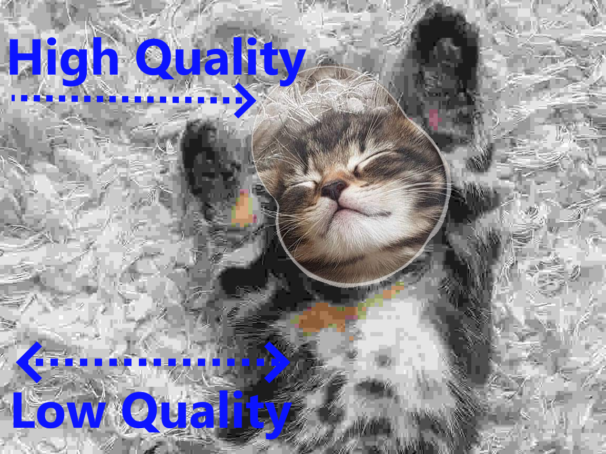

# Abstract

The present disclosure teaches methods for improving perceptual quality of entire image by applying different encoding quality to different regions within the image.

# Description

Numerous input devices can be used to construct regions. For example mouse or eye tracking device.

Each region is used to modify pixel's encoding quality, to increase or decrase quality.

Some encoding methods use pixels as smallest units defining regions and other encoding methods use blocks or macroblocks to define region shape.

# Images

Example of single region in center of original image encoded at maximum quality and rest of the image encoded with minimum quality:

